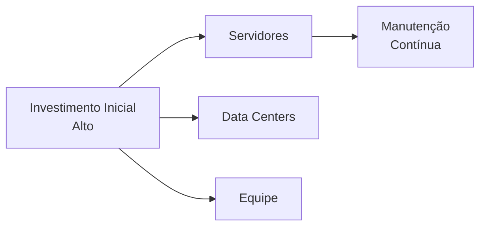
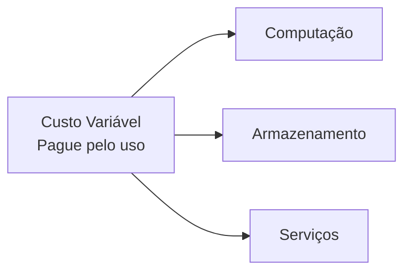
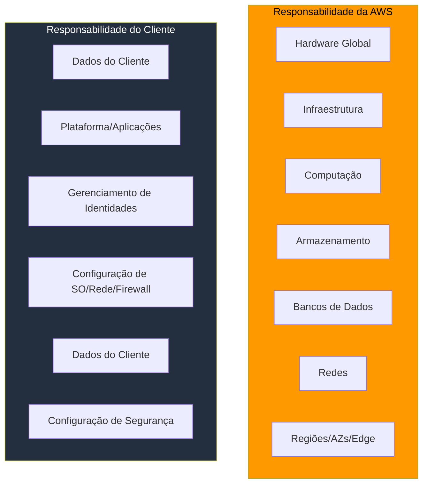
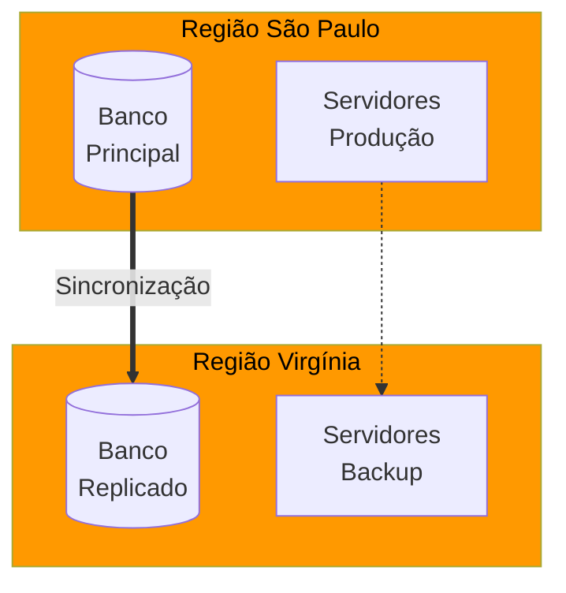

# **PLANO DE AULA - SEMANA 1**
## **Fundamentos de Cloud Computing e Introdução à AWS**

---

## **1. APRESENTAÇÃO (SLIDES) - MARP FOR VSCODE**

```markdown
---
marp: true
theme: uncover
class:
  - lead
  - invert
paginate: true
---

<!-- _class: lead invert -->

# **Fundamentos de Cloud Computing**
## Introdução à Amazon Web Services (AWS)

### Disciplina: Big Data e Cloud Computing
### Semana 1

---

# **Agenda da Aula**

- O que é Computação em Nuvem?
- Modelos de Implantação
- CapEx vs. OpEx
- Vantagens da Nuvem
- Amazon Web Services (AWS)
- Regiões e Zonas de Disponibilidade
- Modelo de Responsabilidade Compartilhada
- Laboratórios Práticos

---

# **O que é Computação em Nuvem?**

> **Definição NIST:** "Modelo que permite acesso onipresente, conveniente e sob demanda a um conjunto compartilhado de recursos computacionais configuráveis (redes, servidores, armazenamento, aplicações e serviços) que podem ser rapidamente provisionados e liberados com mínimo esforço de gerenciamento."

### Características Essenciais:
- ✅ Autosserviço sob demanda
- ✅ Amplo acesso à rede
- ✅ Pooling de recursos
- ✅ Elasticidade rápida
- ✅ Mensuração de serviço

---

# **Modelos de Implantação**

| Modelo | Descrição | Exemplo |
|--------|-----------|---------|
| **Nuvem Pública** | Recursos pertencentes a um provedor terceiro, disponíveis ao público | AWS, Azure, GCP |
| **Nuvem Privada** | Recursos exclusivos de uma única organização | Data center próprio |
| **Nuvem Híbrida** | Combinação de nuvens pública e privada | Empresa + AWS |
| **Comunitária** | Compartilhada por organizações com interesses comuns | Governo, universidades |

---

# **CapEx vs. OpEx: A Revolução Financeira**

## Modelo Tradicional (CapEx)


## Modelo em Nuvem (OpEx)


---

# **Vantagens da Computação em Nuvem**

### 📈 **Econômicas**
- Eliminação de investimentos iniciais
- Redução de custos operacionais
- Modelo "pague pelo que usar"

### ⚡ **Técnicas**
- Elasticidade e escalabilidade
- Alta disponibilidade
- Agilidade e inovação rápida
- Foco no negócio, não na infraestrutura

---

# **Amazon Web Services (AWS)**

### **Líder de Mercado em Cloud Computing**

<div style="display: flex; justify-content: center; gap: 20px;">
<div style="background: #232F3E; padding: 20px; border-radius: 10px;">

**Números Impressionantes:**
- 🏢 Mais de 1 milhão de clientes ativos
- 🌎 33 regiões geográficas
- 📊 105 zonas de disponibilidade
- 💰 US$ 80B+ em receita anual
- 🔧 Mais de 200 serviços

</div>
</div>

---

# **Infraestrutura Global AWS**

## **Regiões e Zonas de Disponibilidade**

```
🌎 REGIÃO (São Paulo - sa-east-1)
    ├── 🏢 Zona de Disponibilidade A (sa-east-1a)
    ├── 🏢 Zona de Disponibilidade B (sa-east-1b)
    └── 🏢 Zona de Disponibilidade C (sa-east-1c)

🌎 REGIÃO (Virgínia - us-east-1)
    ├── 🏢 Zona de Disponibilidade A
    ├── 🏢 Zona de Disponibilidade B
    └── 🏢 Zona de Disponibilidade C
```

### **Edge Locations:** 400+ pontos de presença para conteúdo em cache

---

# **Modelo de Responsabilidade Compartilhada**



---

# **Exemplo 1: Migração de Servidor On-Premises**

### **Cenário Real:**
Uma empresa de e-commerce precisa hospedar um site institucional.

### **Solução Tradicional:**
```python
CUSTOS_ANUAIS = {
    'Servidor Físico': 'R$ 15.000,00',
    'Licenças': 'R$ 3.000,00',
    'Manutenção': 'R$ 5.000,00',
    'Energia/Refrigeração': 'R$ 4.000,00',
    'Técnico Dedicado': 'R$ 36.000,00',
    'TOTAL': 'R$ 63.000,00'
}
```

### **Solução AWS:**
```python
CUSTOS_ANUAIS_AWS = {
    'EC2 t3.micro (Linux)': 'R$ 1.200,00',
    'Armazenamento EBS 30GB': 'R$ 360,00',
    'Transferência de dados': 'R$ 500,00',
    'TOTAL': 'R$ 2.060,00'
}
```

**Economia:** **96,7%** nos custos iniciais!

---

# **Exemplo 2: Elasticidade Sob Demanda**

### **Cenário:**
Startup de streaming que tem picos de audiência aos finais de semana.

```python
import matplotlib.pyplot as plt
import numpy as np

dias = ['Seg', 'Ter', 'Qua', 'Qui', 'Sex', 'Sáb', 'Dom']
usuarios = [1000, 1200, 1100, 1300, 2000, 8000, 7500]

# Gráfico conceitual
plt.figure(figsize=(10,4))
plt.bar(dias, usuarios, color=['blue']*5 + ['orange']*2)
plt.title('Demanda por Streaming Durante a Semana')
plt.ylabel('Usuários Simultâneos')
plt.show()
```

### **Solução AWS:**
- Auto Scaling Groups: adicionam instâncias EC2 automaticamente nos finais de semana
- Reduzem na segunda-feira
- **Economia:** ~60% comparado a manter capacidade máxima 24/7

---

# **Exemplo 3: Startup com AWS Free Tier**

### **MVP (Produto Mínimo Viável) sem custos:**

```yaml
Recursos AWS Free Tier (12 meses):
  
  EC2:
    - 750 horas/mês de t2.micro (Linux/Windows)
    - Suficiente para 1 servidor 24/7
  
  RDS:
    - 750 horas/mês de banco de dados
    - 20GB de armazenamento
  
  S3:
    - 5GB de armazenamento padrão
    - 20.000 GET requests
    - 2.000 PUT requests
  
  DynamoDB:
    - 25GB de armazenamento
    - 200 milhões de requests/mês
```

**Custo total no primeiro ano:** **R$ 0,00**

---

# **Exemplo 4: Disaster Recovery com AWS**

### **Cenário:**
Empresa financeira precisa replicar dados para garantir continuidade.



### **AWS Services:**
- **RDS Multi-AZ:** Alta disponibilidade automática
- **Cross-Region Replication:** Replicação entre regiões
- **S3 CRR:** Replicação entre buckets em regiões diferentes
- **Route 53:** Failover automático

---

# **EXERCÍCIOS PRÁTICOS**

## **Mão na massa com AWS!**

---

# **Exercício 1: Criando sua Conta AWS**

### **Objetivo:** Configurar uma conta AWS Educate/Free Tier

**Passo a passo:**

1. Acesse [aws.amazon.com/pt/educate/](https://aws.amazon.com/pt/educate/)
2. Clique em "Junte-se ao AWS Educate"
3. Preencha seus dados institucionais
4. Verifique seu e-mail
5. Complete o perfil (estudante)
6. Acesse o console AWS

**⏱️ Tempo estimado:** 15 minutos

---

# **Exercício 2: Explorando o Console AWS**

### **Objetivo:** Familiarizar-se com a interface AWS

**Tarefas:**
1. ✅ Faça login no console AWS
2. ✅ Identifique sua região atual (canto superior direito)
3. ✅ Liste todos os serviços disponíveis na categoria "Compute"
4. ✅ Encontre o serviço **EC2** e o **S3**
5. ✅ Configure o faturamento (alertas de custo)

**⏱️ Tempo estimado:** 15 minutos

---

# **QUESTIONÁRIO DE FIXAÇÃO**

## **5 Questões no modelo ENADE**

---

# **Questão 1**

> **ENADE 2018 (adaptada)**: A computação em nuvem tem revolucionado a forma como as empresas adquirem e gerenciam recursos de TI. Considerando os modelos de implantação, avalie as afirmações:

I. Na nuvem pública, os recursos são provisionados para uso exclusivo de uma única organização.
II. A nuvem híbrida permite a orquestração entre infraestruturas on-premises e em nuvem pública.
III. Na nuvem comunitária, a infraestrutura é compartilhada por organizações com interesses comuns.

É correto o que se afirma em:
a) I, apenas
b) II, apenas
c) I e II, apenas
d) II e III, apenas
e) I, II e III

---

# **Questão 2**

> Uma empresa brasileira de tecnologia está migrando seus sistemas para a AWS e precisa escolher uma região para hospedar sua aplicação principal. O público-alvo são usuários brasileiros, e a empresa tem requisitos de baixa latência e conformidade com a LGPD.

Qual região AWS atende melhor a esses requisitos?
a) us-east-1 (Virgínia do Norte)
b) eu-west-1 (Irlanda)
c) sa-east-1 (São Paulo)
d) ap-southeast-1 (Singapura)
e) us-west-2 (Oregon)

---

# **Questão 3**

> **ENADE 2021 (adaptada)**: Considere o seguinte cenário: uma startup deseja lançar um aplicativo mobile e precisa de infraestrutura de TI. Os fundadores querem minimizar investimentos iniciais e pagar apenas pelos recursos utilizados, com capacidade de escalar automaticamente conforme a demanda.

Qual característica da computação em nuvem atende diretamente a essa necessidade?
a) Pooling de recursos
b) Elasticidade
c) Amplo acesso à rede
d) Mensuração de serviço
e) Autosserviço sob demanda

---

# **Questão 4**

> Sobre o Modelo de Responsabilidade Compartilhada da AWS, analise as afirmativas:

1. A AWS é responsável pela segurança **da** nuvem (hardware, software, infraestrutura global)
2. O cliente é responsável pela segurança **na** nuvem (dados, configurações, acesso)
3. Em serviços gerenciados como RDS, a AWS também gerencia o sistema operacional

Estão corretas:
a) 1, apenas
b) 2, apenas
c) 1 e 2, apenas
d) 1 e 3, apenas
e) 1, 2 e 3

---

# **Questão 5**

> Uma empresa deseja migrar seu data center para a nuvem para reduzir custos. Atualmente, ela possui servidores físicos que custam R$ 100.000,00 em Capex (investimento inicial) e R$ 20.000,00 anuais em manutenção.

Qual é a principal vantagem financeira ao migrar para um modelo OpEx na nuvem?
a) Eliminação completa de custos de TI
b) Substituição de custos variáveis por custos fixos
c) Eliminação de investimentos iniciais altos, pagando pelo uso
d) Redução obrigatória de 50% nos custos operacionais
e) Isenção de impostos sobre serviços de TI

---

# **QUESTÕES DISCURSIVAS**

## **Modelo ENADE**

---

# **Questão Discursiva 1**

> **ENADE 2019 (adaptada)**: Uma empresa de médio porte do setor varejista está planejando expandir suas operações de e-commerce. Atualmente, toda a infraestrutura de TI é própria (on-premises) e está localizada em um único data center na cidade de São Paulo. Durante a Black Friday do ano passado, o site ficou indisponível por 4 horas devido à sobrecarga nos servidores, resultando em prejuízos significativos.

Considerando esse cenário, responda:
1. Como a migração para a computação em nuvem AWS poderia resolver o problema de indisponibilidade durante picos de demanda?
2. Explique como o modelo de elasticidade da nuvem funcionaria nesse caso específico.
3. Cite dois serviços AWS que poderiam ser utilizados para garantir alta disponibilidade e justifique sua escolha.

**Critérios de avaliação:**
- Compreensão do conceito de elasticidade (40%)
- Aplicação ao cenário específico (30%)
- Conhecimento dos serviços AWS (30%)

---

# **Questão Discursiva 2**

> Uma startup de tecnologia educacional (EdTech) está desenvolvendo uma plataforma de cursos online que oferecerá vídeo-aulas para estudantes de todo o Brasil. Os fundadores têm orçamento limitado e precisam decidir entre manter servidores próprios ou utilizar a AWS.

Com base nos conceitos de CapEx vs. OpEx e nos modelos de implantação de nuvem:

1. Compare as vantagens e desvantagens de cada modelo (on-premises vs. nuvem) para esta startup específica.
2. Considerando que a startup terá inicialmente 1.000 usuários, mas espera crescer para 100.000 em 2 anos, explique por que a nuvem seria mais adequada.
3. Considerando que a startup terá que armazenar vídeos (arquivos grandes), qual serviço AWS seria mais adequado e por quê?

**Critérios de avaliação:**
- Análise comparativa CapEx/OpEx (30%)
- Aplicação do conceito de escalabilidade (35%)
- Conhecimento de serviços AWS (35%)

---

# **GABARITO COMENTADO**

## **Múltipla Escolha**

---

# **Gabarito - Questão 1**

**Resposta correta: d) II e III, apenas**

**Justificativa ENADE:**
- ❌ Afirmação I: Falsa. Nuvem pública tem recursos compartilhados entre múltiplos clientes (multi-tenancy).
- ✅ Afirmação II: Verdadeira. Nuvem híbrida conecta infraestruturas on-premises e pública.
- ✅ Afirmação III: Verdadeira. Nuvem comunitária é compartilhada por organizações com interesses comuns.

---

# **Gabarito - Questão 2**

**Resposta correta: c) sa-east-1 (São Paulo)**

**Justificativa:**
- ✅ Menor latência para usuários brasileiros
- ✅ Conformidade com LGPD (dados no Brasil)
- ✅ Disponibilidade de todos os serviços principais
- ❌ Outras regiões teriam maior latência e questões legais de dados

---

# **Gabarito - Questão 3**

**Resposta correta: b) Elasticidade**

**Justificativa ENADE:**
- Elasticidade permite provisionar recursos automaticamente conforme a demanda
- Startup paga apenas pelos recursos que usa
- Escala automaticamente quando necessário
- As outras características são importantes, mas não atendem diretamente à necessidade descrita

---

# **Gabarito - Questão 4**

**Resposta correta: e) 1, 2 e 3**

**Justificativa:**
- ✅ (1) Correta: AWS cuida da infraestrutura global
- ✅ (2) Correta: Cliente gerencia dados, identidades e configurações
- ✅ (3) Correta: Em serviços gerenciados (PaaS), AWS gerencia SO e plataforma

---

# **Gabarito - Questão 5**

**Resposta correta: c) Eliminação de investimentos iniciais altos, pagando pelo uso**

**Justificativa:**
- Modelo OpEx substitui Capex alto por pagamento mensal variável
- Não elimina todos os custos (a está errada)
- Transforma fixo em variável, não o contrário (b errada)
- Não há garantia de redução de 50% (d errada)
- Não isenta impostos (e errada)

---

# **Gabarito Orientativo - Discursiva 1**

### **Resposta esperada:**

**1. Solução do problema:**
- A elasticidade da nuvem permitiria aumentar automaticamente a capacidade durante a Black Friday
- Múltiplas zonas de disponibilidade evitariam queda total

**2. Funcionamento da elasticidade:**
- Auto Scaling Groups monitoram a demanda (CPU, memória, requests)
- Quando a demanda aumenta, novas instâncias EC2 são provisionadas automaticamente
- Quando a demanda diminui, instâncias são removidas

**3. Serviços AWS:**
- **ELB (Elastic Load Balancing):** Distribui tráfego entre múltiplas instâncias
- **RDS Multi-AZ:** Banco de dados replicado em diferentes zonas
- **Route 53:** Roteamento DNS com failover automático

---

# **Gabarito Orientativo - Discursiva 2**

### **Resposta esperada:**

**1. Comparação:**
| Aspecto | On-premises | Nuvem AWS |
|---------|-------------|-----------|
| Investimento | Alto (servidores) | Zero (Free Tier) |
| Manutenção | Equipe dedicada | Gerenciada pela AWS |
| Escalabilidade | Limitada | Ilimitada |
| Tempo de implantação | Meses | Minutos |

**2. Escalabilidade:**
- Crescimento de 1.000 para 100.000 usuários requer infraestrutura flexível
- Na nuvem, escala-se sem novos investimentos em hardware
- Paga-se apenas pelos recursos adicionais conforme cresce

**3. Armazenamento de vídeos:**
- **Amazon S3:** Ideal para arquivos grandes e estáticos
- **CloudFront:** CDN para entregar vídeos com baixa latência
- **Elastic Transcoder:** Converte vídeos para diferentes formatos

---

# **REFERÊNCIAS DA AULA**

### **Leitura Obrigatória:**
- Documentação AWS: "Visão Geral da Nuvem AWS"
- NIST Definition of Cloud Computing (SP 800-145)

### **Leitura Complementar:**
- AWS Well-Architected Framework
- Guia de Introdução ao AWS Educate

### **Links Úteis:**
- [aws.amazon.com/pt/free](https://aws.amazon.com/pt/free)
- [aws.amazon.com/pt/educate](https://aws.amazon.com/pt/educate)
- [console.aws.amazon.com](https://console.aws.amazon.com)

---

<!-- _class: lead invert -->

# **Dúvidas?**

### **Próxima aula: Modelos de Serviço em Nuvem (IaaS, PaaS, SaaS)**

**Tarefa para casa:**
- Complete os exercícios práticos
- Responda o questionário no AVA
- Leia o capítulo 1 do livro "Jornada Cloud Native"

---

```

---

## **2. QUATRO EXEMPLOS DETALHADOS**

### **Exemplo 1: Comparação de Custos - On-Premises vs. AWS**

```python
# exemplo_1_comparacao_custos.py
"""
EXEMPLO 1: Comparação detalhada de custos entre modelo tradicional e AWS
Cenário: Empresa de médio porte precisa de 10 servidores para aplicações web
"""

class CalculadoraCustosTI:
    def __init__(self, nome_empresa, num_servidores):
        self.nome_empresa = nome_empresa
        self.num_servidores = num_servidores
    
    def calcular_custos_on_premises(self):
        """Calcula custos no modelo tradicional (CapEx)"""
        print(f"\n{'='*60}")
        print(f"EMPRESA: {self.nome_empresa}")
        print(f"CÁLCULO DE CUSTOS - MODELO ON-PREMISES")
        print(f"{'='*60}")
        
        # Custos de aquisição (CapEx)
        servidores = self.num_servidores * 25000  # R$ 25.000 por servidor
        storage = 50000  # R$ 50.000 em storage
        switches = 15000  # R$ 15.000 em switches
        rack = 8000  # R$ 8.000 em racks
        no_break = 12000  # R$ 12.000 em no-break
        ar_condicionado = 10000  # R$ 10.000 em ar condicionado
        
        total_capex = servidores + storage + switches + rack + no_break + ar_condicionado
        
        print(f"\n📦 CUSTOS DE AQUISIÇÃO (CapEx):")
        print(f"   Servidores ({self.num_servidores} x R$ 25.000): R$ {servidores:,.2f}")
        print(f"   Storage: R$ {storage:,.2f}")
        print(f"   Switches: R$ {switches:,.2f}")
        print(f"   Rack: R$ {rack:,.2f}")
        print(f"   No-break: R$ {no_break:,.2f}")
        print(f"   Ar condicionado: R$ {ar_condicionado:,.2f}")
        print(f"   {'='*40}")
        print(f"   TOTAL CapEx: R$ {total_capex:,.2f}")
        
        # Custos operacionais anuais (OpEx)
        energia = self.num_servidores * 300 * 12  # R$ 300/mês por servidor
        manutencao = total_capex * 0.15  # 15% do CapEx em manutenção anual
        equipe = 3 * 6000 * 12  # 3 técnicos a R$ 6.000/mês
        licencas = self.num_servidores * 200 * 12  # R$ 200/mês por servidor em licenças
        
        total_opex_anual = energia + manutencao + equipe + licencas
        
        print(f"\n⚙️  CUSTOS OPERACIONAIS ANUAIS (OpEx):")
        print(f"   Energia: R$ {energia:,.2f}")
        print(f"   Manutenção (15% do CapEx): R$ {manutencao:,.2f}")
        print(f"   Equipe de TI (3 técnicos): R$ {equipe:,.2f}")
        print(f"   Licenças de software: R$ {licencas:,.2f}")
        print(f"   {'='*40}")
        print(f"   TOTAL OpEx Anual: R$ {total_opex_anual:,.2f}")
        
        # Custo total em 3 anos
        custo_total_3anos = total_capex + (total_opex_anual * 3)
        
        print(f"\n💰 CUSTO TOTAL (3 anos): R$ {custo_total_3anos:,.2f}")
        
        return {
            'capex': total_capex,
            'opex_anual': total_opex_anual,
            'total_3anos': custo_total_3anos
        }
    
    def calcular_custos_aws(self):
        """Calcula custos na AWS (OpEx puro)"""
        print(f"\n{'='*60}")
        print(f"EMPRESA: {self.nome_empresa}")
        print(f"CÁLCULO DE CUSTOS - MODELO AWS")
        print(f"{'='*60}")
        
        # Custos na AWS (estimativas mensais)
        # EC2: instâncias t3.medium (2 vCPU, 4GB RAM)
        ec2 = self.num_servidores * 150  # R$ 150/mês por instância (reservada parcial)
        
        # RDS: banco de dados gerenciado
        rds = 300  # R$ 300/mês por instância de banco
        
        # S3: armazenamento de objetos
        s3 = 100  # R$ 100/mês para 1TB
        
        # Load Balancer
        elb = 50  # R$ 50/mês
        
        # Transferência de dados
        data_transfer = 200  # R$ 200/mês
        
        total_mensal = ec2 + rds + s3 + elb + data_transfer
        
        print(f"\n☁️  CUSTOS MENSAIS NA AWS:")
        print(f"   EC2 ({self.num_servidores} x t3.medium): R$ {ec2:,.2f}")
        print(f"   RDS (banco de dados): R$ {rds:,.2f}")
        print(f"   S3 (armazenamento): R$ {s3:,.2f}")
        print(f"   Load Balancer: R$ {elb:,.2f}")
        print(f"   Transferência de dados: R$ {data_transfer:,.2f}")
        print(f"   {'='*40}")
        print(f"   TOTAL Mensal: R$ {total_mensal:,.2f}")
        print(f"   TOTAL Anual: R$ {total_mensal * 12:,.2f}")
        print(f"   TOTAL em 3 anos: R$ {total_mensal * 36:,.2f}")
        
        return {
            'mensal': total_mensal,
            'anual': total_mensal * 12,
            'total_3anos': total_mensal * 36
        }

# Simulação
empresa = CalculadoraCustosTI("TechStore Brasil", 10)
on_premises = empresa.calcular_custos_on_premises()
aws = empresa.calcular_custos_aws()

print(f"\n{'🔍 COMPARAÇÃO FINAL':^60}")
print(f"{'='*60}")
print(f"On-Premises (3 anos): R$ {on_premises['total_3anos']:,.2f}")
print(f"AWS (3 anos): R$ {aws['total_3anos']:,.2f}")
economia = on_premises['total_3anos'] - aws['total_3anos']
percentual = (economia / on_premises['total_3anos']) * 100
print(f"\n✅ ECONOMIA COM AWS: R$ {economia:,.2f} ({percentual:.1f}%)")
```

### **Exemplo 2: Simulador de Elasticidade**

```python
# exemplo_2_simulador_elasticidade.py
"""
EXEMPLO 2: Simulador de elasticidade na AWS
Cenário: Aplicação de e-commerce com variação de demanda durante o ano
"""

import random
from datetime import datetime, timedelta
import matplotlib.pyplot as plt
from typing import List, Dict

class SimuladorElasticidadeAWS:
    def __init__(self, nome_aplicacao: str):
        self.nome_aplicacao = nome_aplicacao
        self.historico_uso = []
        self.historico_instancias = []
        
    def simular_demanda(self, dias: int = 30) -> List[int]:
        """
        Simula demanda diária de uma aplicação
        """
        demanda = []
        data_inicio = datetime.now()
        
        for dia in range(dias):
            data = data_inicio + timedelta(days=dia)
            
            # Padrões de demanda baseados no dia da semana
            if data.weekday() >= 5:  # Fim de semana
                demanda_base = random.randint(5000, 8000)
            else:  # Dia de semana
                demanda_base = random.randint(2000, 4000)
            
            # Eventos especiais
            if data.month == 11 and data.day > 20:  # Black Friday
                demanda_base *= 3
            elif data.month == 12:  # Natal
                demanda_base *= 2
            
            # Adiciona variação aleatória
            demanda_dia = int(demanda_base * (1 + random.uniform(-0.2, 0.2)))
            demanda.append(demanda_dia)
            
        return demanda
    
    def calcular_instancias_necessarias(self, demanda: int) -> int:
        """
        Calcula número de instâncias EC2 necessárias baseado na demanda
        Cada instância suporta 1000 usuários simultâneos
        """
        capacidade_por_instancia = 1000
        return max(1, (demanda + capacidade_por_instancia - 1) // capacidade_por_instancia)
    
    def simulacao_tradicional(self, demanda: List[int]):
        """
        Simula modelo tradicional com capacidade fixa (superdimensionada)
        """
        capacidade_fixa = max(demanda) // 800  # Superdimensionada
        instancias_fixas = max(5, capacidade_fixa)  # Mínimo de 5 instâncias
        
        custos_fixos = []
        for i, demanda_dia in enumerate(demanda):
            custo_dia = instancias_fixas * 5  # R$ 5 por instância por dia
            custos_fixos.append({
                'dia': i + 1,
                'demanda': demanda_dia,
                'instancias': instancias_fixas,
                'custo': custo_dia,
                'ociosidade': max(0, (instancias_fixas * 1000) - demanda_dia)
            })
        
        return custos_fixos
    
    def simulacao_aws_auto_scaling(self, demanda: List[int]):
        """
        Simula modelo AWS com Auto Scaling (elástico)
        """
        custos_elasticos = []
        
        for i, demanda_dia in enumerate(demanda):
            instancias_necessarias = self.calcular_instancias_necessarias(demanda_dia)
            # Adiciona 20% de buffer por segurança
            instancias_finais = int(instancias_necessarias * 1.2)
            
            custo_dia = instancias_finais * 5  # R$ 5 por instância por dia
            
            custos_elasticos.append({
                'dia': i + 1,
                'demanda': demanda_dia,
                'instancias': instancias_finais,
                'custo': custo_dia,
                'atendimento': min(100, (demanda_dia / (instancias_finais * 1000)) * 100)
            })
        
        return custos_elasticos
    
    def executar_simulacao(self, dias: int = 30):
        """
        Executa simulação completa e gera relatório
        """
        print(f"\n{'='*70}")
        print(f"SIMULADOR DE ELASTICIDADE AWS")
        print(f"Aplicação: {self.nome_aplicacao}")
        print(f"Período: {dias} dias")
        print(f"{'='*70}")
        
        # Gera demanda simulada
        demanda = self.simular_demanda(dias)
        
        # Executa simulações
        tradicional = self.simulacao_tradicional(demanda)
        aws_auto = self.simulacao_aws_auto_scaling(demanda)
        
        # Calcula totais
        total_custo_trad = sum(d['custo'] for d in tradicional)
        total_custo_aws = sum(d['custo'] for d in aws_auto)
        
        # Estatísticas
        media_instancias_trad = sum(d['instancias'] for d in tradicional) / dias
        media_instancias_aws = sum(d['instancias'] for d in aws_auto) / dias
        
        pico_demanda = max(demanda)
        dia_pico = demanda.index(pico_demanda) + 1
        
        print(f"\n📊 ESTATÍSTICAS DA DEMANDA:")
        print(f"   Demanda média: {sum(demanda)/dias:.0f} usuários/dia")
        print(f"   Demanda mínima: {min(demanda)} usuários")
        print(f"   Demanda máxima: {pico_demanda} usuários (dia {dia_pico})")
        
        print(f"\n🏢 MODELO TRADICIONAL (Capacidade Fixa):")
        print(f"   Instâncias fixas: {tradicional[0]['instancias']}")
        print(f"   Média de instâncias: {media_instancias_trad:.1f}")
        print(f"   Custo total: R$ {total_custo_trad:,.2f}")
        
        print(f"\n☁️  MODELO AWS COM AUTO SCALING:")
        print(f"   Média de instâncias: {media_instancias_aws:.1f}")
        print(f"   Instâncias no pico: {aws_auto[dia_pico-1]['instancias']}")
        print(f"   Instâncias em baixa demanda: {min(d['instancias'] for d in aws_auto)}")
        print(f"   Custo total: R$ {total_custo_aws:,.2f}")
        
        economia = total_custo_trad - total_custo_aws
        percentual = (economia / total_custo_trad) * 100
        
        print(f"\n💰 ECONOMIA COM ELASTICIDADE:")
        print(f"   R$ {economia:,.2f} em {dias} dias")
        print(f"   {percentual:.1f}% de redução de custos")
        
        return {
            'tradicional': tradicional,
            'aws': aws_auto,
            'economia': economia,
            'percentual': percentual
        }

# Executar simulação
simulador = SimuladorElasticidadeAWS("Meu E-commerce")
resultados = simulador.executar_simulacao(60)
```

### **Exemplo 3: Disaster Recovery na AWS**

```python
# exemplo_3_disaster_recovery.py
"""
EXEMPLO 3: Planejamento de Disaster Recovery na AWS
Cenário: Empresa financeira precisa garantir continuidade dos negócios
"""

class PlanejadorDisasterRecovery:
    def __init__(self, nome_empresa: str, regiao_principal: str, regiao_secundaria: str):
        self.nome_empresa = nome_empresa
        self.regiao_principal = regiao_principal
        self.regiao_secundaria = regiao_secundaria
        self.rto = 0  # Recovery Time Objective (tempo máximo de recuperação)
        self.rpo = 0  # Recovery Point Objective (perda máxima de dados)
        
    def definir_objetivos_recuperacao(self, rto_horas: int, rpo_minutos: int):
        """
        Define os objetivos de recuperação
        RTO: quanto tempo para recuperar
        RPO: quantos dados podem ser perdidos
        """
        self.rto = rto_horas
        self.rpo = rpo_minutos
        
        print(f"\n{'='*70}")
        print(f"PLANEJAMENTO DE DISASTER RECOVERY")
        print(f"Empresa: {self.nome_empresa}")
        print(f"{'='*70}")
        print(f"\n🎯 OBJETIVOS DEFINIDOS:")
        print(f"   RTO (Recovery Time Objective): {rto_horas} horas")
        print(f"   RPO (Recovery Point Objective): {rpo_minutos} minutos")
        
    def recomendar_estrategia(self, criticidade: str):
        """
        Recomenda estratégia de DR baseada na criticidade
        """
        estrategias = {
            'baixa': {
                'nome': 'Backup and Restore',
                'descricao': 'Backups diários para S3 com replicação entre regiões',
                'rto_estimado': 24,  # horas
                'rpo_estimado': 1440,  # minutos (24h)
                'custo_mensal': 1000,
                'servicos': ['AWS Backup', 'S3 Cross-Region Replication']
            },
            'media': {
                'nome': 'Pilot Light',
                'descricao': 'Réplica mínima na região secundária, escalável em caso de desastre',
                'rto_estimado': 4,  # horas
                'rpo_estimado': 60,  # minutos
                'custo_mensal': 5000,
                'servicos': ['EC2 (instâncias mínimas)', 'RDS Multi-AZ', 'Route 53']
            },
            'alta': {
                'nome': 'Warm Standby',
                'descricao': 'Ambiente reduzido mas funcional na região secundária',
                'rto_estimado': 1,  # hora
                'rpo_estimado': 5,  # minutos
                'custo_mensal': 15000,
                'servicos': ['EC2 Auto Scaling', 'RDS Cross-Region', 'ElastiCache']
            },
            'missao_critica': {
                'nome': 'Multi-Site Active-Active',
                'descricao': 'Tráfego distribuído entre regiões com failover automático',
                'rto_estimado': 0.25,  # 15 minutos
                'rpo_estimado': 0,  # perda zero
                'custo_mensal': 50000,
                'servicos': ['Global Accelerator', 'DynamoDB Global Tables', 'Aurora Global']
            }
        }
        
        estrategia = estrategias.get(criticidade, estrategias['media'])
        
        print(f"\n📋 ESTRATÉGIA RECOMENDADA: {estrategia['nome']}")
        print(f"   Descrição: {estrategia['descricao']}")
        print(f"   RTO estimado: {estrategia['rto_estimado']} horas")
        print(f"   RPO estimado: {estrategia['rpo_estimado']} minutos")
        print(f"   Custo mensal estimado: R$ {estrategia['custo_mensal']:,.2f}")
        print(f"\n   Serviços AWS recomendados:")
        for servico in estrategia['servicos']:
            print(f"     • {servico}")
        
        # Verifica se atende aos objetivos
        if estrategia['rto_estimado'] <= self.rto and estrategia['rpo_estimado'] <= self.rpo:
            print(f"\n✅ Esta estratégia ATENDE aos objetivos definidos!")
        else:
            print(f"\n⚠️  Esta estratégia NÃO ATENDE aos objetivos definidos!")
            if estrategia['rto_estimado'] > self.rto:
                print(f"   RTO estimado ({estrategia['rto_estimado']}h) > RTO desejado ({self.rto}h)")
            if estrategia['rpo_estimado'] > self.rpo:
                print(f"   RPO estimado ({estrategia['rpo_estimado']}min) > RPO desejado ({self.rpo}min)")
        
        return estrategia
    
    def simular_failover(self):
        """
        Simula um cenário de failover entre regiões
        """
        print(f"\n{'='*70}")
        print(f"SIMULAÇÃO DE FAILOVER")
        print(f"Região Principal: {self.regiao_principal}")
        print(f"Região Secundária: {self.regiao_secundaria}")
        print(f"{'='*70}")
        
        print(f"\n🔴 FASE 1: DETECÇÃO DO DESASTRE")
        print(f"   • Health checks falham na região {self.regiao_principal}")
        print(f"   • CloudWatch dispara alarmes")
        print(f"   • Tempo de detecção: 1 minuto")
        
        print(f"\n🟡 FASE 2: DECISÃO DE FAILOVER")
        print(f"   • Sistema automático confirma falha")
        print(f"   • Verifica integridade da região secundária")
        print(f"   • Tempo de decisão: 2 minutos")
        
        print(f"\n🟢 FASE 3: EXECUÇÃO DO FAILOVER")
        print(f"   • Route 53 atualiza DNS para região {self.regiao_secundaria}")
        print(f"   • Banco de dados promove réplica para primário")
        print(f"   • Auto Scaling aumenta capacidade na região secundária")
        print(f"   • Tempo de execução: 5 minutos")
        
        print(f"\n✅ FASE 4: VALIDAÇÃO")
        print(f"   • Testes de integridade executados")
        print(f"   • Sistema operacional na região secundária")
        print(f"   • Tempo total de recuperação: 8 minutos")
        
        return 8  # minutos totais

# Exemplo de uso
dr = PlanejadorDisasterRecovery(
    nome_empresa="Banco Digital S.A.",
    regiao_principal="sa-east-1 (São Paulo)",
    regiao_secundaria="us-east-1 (Virgínia)"
)

dr.definir_objetivos_recuperacao(rto_horas=2, rpo_minutos=15)
estrategia = dr.recomendar_estrategia("alta")
tempo_recuperacao = dr.simular_failover()
```

### **Exemplo 4: Free Tier Calculator**

```python
# exemplo_4_free_tier_calculator.py
"""
EXEMPLO 4: Calculadora de Free Tier AWS
Cenário: Startup quer maximizar uso do Free Tier no primeiro ano
"""

class AWSCalculadoraFreeTier:
    """
    Calculadora para ajudar startups a maximizar o uso do Free Tier AWS
    """
    
    def __init__(self, nome_startup: str):
        self.nome_startup = nome_startup
        self.servicos_utilizados = []
        self.limites_free_tier = {
            'EC2': {
                'limite': '750 horas/mês de t2.micro ou t3.micro',
                'descricao': 'Instâncias de computação',
                'custo_excedente': 0.0116,  # USD por hora (aproximado)
                'unidade': 'horas'
            },
            'S3': {
                'limite': '5 GB de armazenamento padrão',
                'descricao': 'Armazenamento de objetos',
                'custo_excedente': 0.023,  # USD por GB/mês
                'unidade': 'GB'
            },
            'RDS': {
                'limite': '750 horas/mês de db.t2.micro',
                'descricao': 'Banco de dados relacional',
                'custo_excedente': 0.017,  # USD por hora
                'unidade': 'horas'
            },
            'DynamoDB': {
                'limite': '25 GB de armazenamento + 200M requests/mês',
                'descricao': 'Banco NoSQL',
                'custo_excedente': 0.00065,  # USD por 1M requests (escrita)
                'unidade': 'requests'
            },
            'CloudFront': {
                'limite': '1 TB de transferência/mês',
                'descricao': 'CDN',
                'custo_excedente': 0.085,  # USD por GB
                'unidade': 'GB'
            },
            'Lambda': {
                'limite': '1M requests/mês + 400.000 GB-segundos',
                'descricao': 'Computação serverless',
                'custo_excedente': 0.0000002,  # USD por request adicional
                'unidade': 'requests'
            }
        }
    
    def adicionar_servico(self, servico: str, uso_mensal: float):
        """
        Adiciona um serviço com seu uso estimado
        """
        if servico not in self.limites_free_tier:
            print(f"❌ Serviço {servico} não encontrado na calculadora")
            return
        
        self.servicos_utilizados.append({
            'servico': servico,
            'uso_mensal': uso_mensal,
            'limite_info': self.limites_free_tier[servico]
        })
        
        print(f"✅ Serviço {servico} adicionado com uso de {uso_mensal} unidades")
    
    def calcular_custos_primeiro_ano(self, meses_gratuitos: int = 12):
        """
        Calcula custos considerando Free Tier
        """
        print(f"\n{'='*70}")
        print(f"CALCULADORA FREE TIER AWS")
        print(f"Startup: {self.nome_startup}")
        print(f"Período gratuito: {meses_gratuitos} meses")
        print(f"{'='*70}")
        
        custo_total = 0
        resumo = []
        
        for servico in self.servicos_utilizados:
            nome = servico['servico']
            uso = servico['uso_mensal']
            info = servico['limite_info']
            
            # Extrai o limite numérico do texto
            if nome == 'EC2':
                limite = 750  # horas
                uso_ajustado = uso
            elif nome == 'S3':
                limite = 5  # GB
                uso_ajustado = uso
            elif nome == 'RDS':
                limite = 750  # horas
                uso_ajustado = uso
            elif nome == 'DynamoDB':
                limite = 25  # GB para armazenamento
                uso_ajustado = uso
            elif nome == 'CloudFront':
                limite = 1024  # GB (1TB)
                uso_ajustado = uso
            elif nome == 'Lambda':
                limite = 1000000  # requests
                uso_ajustado = uso
            else:
                limite = 0
                uso_ajustado = uso
            
            # Calcula excedente após período gratuito
            excedente_mensal = max(0, uso_ajustado - limite)
            
            if excedente_mensal > 0:
                custo_excedente_mensal = excedente_mensal * info['custo_excedente']
                custo_excedente_anual = custo_excedente_mensal * (12 - meses_gratuitos)
            else:
                custo_excedente_mensal = 0
                custo_excedente_anual = 0
            
            custo_total += custo_excedente_anual
            
            resumo.append({
                'servico': nome,
                'descricao': info['descricao'],
                'uso_mensal': uso_ajustado,
                'limite': limite,
                'excedente_mensal': excedente_mensal,
                'custo_excedente_anual': custo_excedente_anual
            })
        
        # Exibe resumo
        print(f"\n📊 RESUMO DE USO - PRIMEIRO ANO")
        print(f"{'-'*70}")
        
        for item in resumo:
            print(f"\n🔹 {item['servico']} - {item['descricao']}")
            print(f"   Uso mensal: {item['uso_mensal']:.0f} unidades")
            print(f"   Limite Free Tier: {item['limite']} unidades")
            print(f"   Excedente mensal: {item['excedente_mensal']:.0f} unidades")
            if item['custo_excedente_anual'] > 0:
                print(f"   Custo excedente (após free tier): US$ {item['custo_excedente_anual']:.2f}")
            else:
                print(f"   ✅ Dentro do Free Tier - Sem custos")
        
        print(f"\n{'='*70}")
        print(f"💰 CUSTO TOTAL NO PRIMEIRO ANO: US$ {custo_total:.2f}")
        
        if custo_total == 0:
            print(f"\n🎉 PARABÉNS! Sua startup pode operar gratuitamente por {meses_gratuitos} meses!")
            print(f"   Aproveite para desenvolver seu MVP sem custos de infraestrutura!")
        
        return custo_total
    
    def recomendar_arquitetura_mvp(self):
        """
        Recomenda uma arquitetura MVP que maximize o Free Tier
        """
        print(f"\n{'='*70}")
        print(f"ARQUITETURA RECOMENDADA PARA MVP")
        print(f"{'='*70}")
        
        print(f"""
🌐 ARQUITETURA SERVERLESS (Custo Zero no Free Tier):

    [Usuários] 
         ↓
    [CloudFront] - CDN (1TB grátis/mês)
         ↓
    [S3] - Site estático/Hospedagem (5GB grátis)
         ↓
    [API Gateway] - Roteamento (1M chamadas grátis)
         ↓
    [Lambda] - Lógica de negócio (1M requests grátis)
         ↓
    [DynamoDB] - Banco de dados (25GB grátis)

📋 PLANO DE IMPLEMENTAÇÃO:

    Mês 1-3:
    • Desenvolva front-end estático no S3
    • Use Lambda para funções básicas
    • DynamoDB para dados de usuários
    
    Mês 4-6:
    • Adicione autenticação com Cognito
    • Implemente filas com SQS (1M grátis)
    • Use SNS para notificações
    
    Mês 7-12:
    • Monitore uso com CloudWatch (10 métricas grátis)
    • Prepare-se para escalar após o período gratuito
        """)

# Exemplo de uso
startup = AWSCalculadoraFreeTier("Minha Startup Inovadora")

# Adiciona serviços com uso estimado
startup.adicionar_servico('EC2', 500)  # 500 horas/mês (abaixo do limite)
startup.adicionar_servico('S3', 3)      # 3 GB de armazenamento
startup.adicionar_servico('Lambda', 800000)  # 800k requests/mês
startup.adicionar_servico('DynamoDB', 20)  # 20 GB de dados

startup.calcular_custos_primeiro_ano()
startup.recomendar_arquitetura_mvp()
```

---

## **3. EXERCÍCIOS PRÁTICOS**

### **Exercício Prático 1: Criando sua Conta AWS**

```python
"""
EXERCÍCIO PRÁTICO 1: Criando sua Conta AWS
Nome do Aluno: ______________________
Data: ______________________

Objetivo: Criar e configurar uma conta AWS Educate/Free Tier
"""

class ExercicioAWS:
    def __init__(self, nome_aluno):
        self.nome_aluno = nome_aluno
        self.checklist = []
        self.conta_criada = False
        
    def passo1_acessar_aws_educate(self):
        """Passo 1: Acessar o site AWS Educate"""
        print("\n📝 PASSO 1: Acessar AWS Educate")
        print("1. Abra o navegador e acesse: https://aws.amazon.com/pt/educate/")
        print("2. Localize e clique no botão 'Junte-se ao AWS Educate'")
        print("3. Verifique se você está no site oficial da Amazon")
        
        resposta = input("\n✅ Você conseguiu acessar o site? (s/n): ")
        if resposta.lower() == 's':
            self.checklist.append('Acessou AWS Educate')
            return True
        else:
            print("❌ Tente novamente ou peça ajuda ao professor")
            return False
    
    def passo2_preencher_cadastro(self):
        """Passo 2: Preencher dados de cadastro"""
        print("\n📝 PASSO 2: Preencher cadastro")
        print("1. Selecione 'Student' como tipo de usuário")
        print("2. Preencha seu nome completo")
        print("3. Use seu e-mail institucional")
        print("4. Preencha os dados da sua instituição")
        print("5. Crie uma senha forte")
        
        resposta = input("\n✅ Você completou o cadastro? (s/n): ")
        if resposta.lower() == 's':
            self.checklist.append('Cadastro preenchido')
            return True
        else:
            print("❌ Complete o cadastro antes de prosseguir")
            return False
    
    def passo3_verificar_email(self):
        """Passo 3: Verificar e-mail"""
        print("\n📝 PASSO 3: Verificar e-mail")
        print("1. Acesse sua caixa de e-mail")
        print("2. Procure por e-mail da AWS Educate")
        print("3. Clique no link de verificação")
        print("4. Pode levar alguns minutos - verifique spam")
        
        resposta = input("\n✅ Você verificou seu e-mail? (s/n): ")
        if resposta.lower() == 's':
            self.checklist.append('E-mail verificado')
            return True
        else:
            print("❌ Verifique seu e-mail e tente novamente")
            return False
    
    def passo4_completar_perfil(self):
        """Passo 4: Completar perfil"""
        print("\n📝 PASSO 4: Completar perfil")
        print("1. Faça login no AWS Educate")
        print("2. Complete seu perfil acadêmico")
        print("3. Confirme seus dados")
        
        resposta = input("\n✅ Você completou o perfil? (s/n): ")
        if resposta.lower() == 's':
            self.checklist.append('Perfil completo')
            self.conta_criada = True
            return True
        else:
            print("❌ Complete seu perfil")
            return False
    
    def passo5_explorar_console(self):
        """Passo 5: Explorar o console"""
        if not self.conta_criada:
            print("⚠️ Complete os passos anteriores primeiro")
            return
        
        print("\n📝 PASSO 5: Explorar o Console AWS")
        print("Agora vamos explorar o console!")
        
        # Perguntas de exploração
        print("\nResponda às perguntas abaixo:")
        
        regiao = input("1. Qual região está selecionada no canto superior direito? ")
        servicos = input("2. Liste 3 serviços que você encontrou na categoria 'Compute': ")
        
        print("\n📌 Salve suas respostas:")
        print(f"Região atual: {regiao}")
        print(f"Serviços de computação: {servicos}")
        
        self.checklist.append('Console explorado')
    
    def gerar_relatorio(self):
        """Gera relatório final do exercício"""
        print("\n" + "="*60)
        print(f"RELATÓRIO DO EXERCÍCIO - {self.nome_aluno}")
        print("="*60)
        
        print(f"\nChecklist concluído ({len(self.checklist)}/5 itens):")
        for i, item in enumerate(self.checklist, 1):
            print(f"  {i}. ✅ {item}")
        
        if len(self.checklist) >= 4:
            print(f"\n🎉 PARABÉNS! Conta AWS configurada com sucesso!")
            print("Você agora tem acesso ao AWS Educate e pode começar a usar os serviços gratuitamente.")
        else:
            print(f"\n⚠️ Você ainda não completou todos os passos.")
            print("Faltam: ", 5 - len(self.checklist), "passos")
        
        return self.checklist

# Executar exercício
aluno = ExercicioAWS("João Silva")
aluno.passo1_acessar_aws_educate()
aluno.passo2_preencher_cadastro()
aluno.passo3_verificar_email()
aluno.passo4_completar_perfil()
aluno.passo5_explorar_console()
aluno.gerar_relatorio()
```

### **Exercício Prático 2: Explorando o Console AWS**

```python
"""
EXERCÍCIO PRÁTICO 2: Explorando o Console AWS
Nome do Aluno: ______________________
Data: ______________________

Objetivo: Familiarizar-se com a interface e serviços AWS
"""

class ExploradorConsoleAWS:
    def __init__(self, nome_aluno):
        self.nome_aluno = nome_aluno
        self.descobertas = []
        self.servicos_encontrados = {}
        
    def missao1_identificar_regiao(self):
        """Missão 1: Identificar região atual"""
        print("\n🌎 MISSÃO 1: IDENTIFICAR REGIÃO")
        print("Objetivo: Encontrar sua região atual no console AWS")
        
        print("\nInstruções:")
        print("1. Acesse o console AWS")
        print("2. Olhe no canto superior direito")
        print("3. Localize o nome da região (ex: US East (N. Virginia) us-east-1)")
        
        regiao = input("\nDigite o nome da região encontrada: ")
        
        # Mapeamento de regiões
        regioes = {
            'us-east-1': 'US East (N. Virginia)',
            'us-east-2': 'US East (Ohio)',
            'us-west-1': 'US West (N. California)',
            'us-west-2': 'US West (Oregon)',
            'sa-east-1': 'South America (São Paulo)',
            'eu-west-1': 'EU (Ireland)',
            'eu-central-1': 'EU (Frankfurt)',
            'ap-southeast-1': 'Asia Pacific (Singapore)',
            'ap-northeast-1': 'Asia Pacific (Tokyo)'
        }
        
        encontrou = False
        for codigo, nome in regioes.items():
            if codigo in regiao.lower() or nome.lower() in regiao.lower():
                encontrou = True
                print(f"\n✅ CORRETO! Você está na região {nome} ({codigo})")
                self.descobertas.append(f"Região identificada: {nome}")
                break
        
        if not encontrou:
            print(f"\n⚠️ Região identificada: {regiao}")
            print("Anote esta informação - você pode verificar no console")
            self.descobertas.append(f"Região: {regiao}")
    
    def missao2_encontrar_servicos_compute(self):
        """Missão 2: Encontrar serviços de computação"""
        print("\n💻 MISSÃO 2: SERVIÇOS DE COMPUTAÇÃO")
        print("Objetivo: Listar todos os serviços na categoria 'Compute'")
        
        print("\nInstruções:")
        print("1. No console AWS, clique em 'Services'")
        print("2. Procure pela categoria 'Compute'")
        print("3. Liste todos os serviços encontrados")
        
        servicos_esperados = ['EC2', 'Lambda', 'Elastic Beanstalk', 'ECS', 'EKS', 'Lightsail', 'Batch']
        
        print("\nDigite os serviços encontrados (um por linha, Enter para finalizar):")
        servicos_encontrados = []
        while True:
            servico = input("> ")
            if not servico:
                break
            servicos_encontrados.append(servico)
        
        self.servicos_encontrados['Compute'] = servicos_encontrados
        
        print(f"\n📊 Você encontrou {len(servicos_encontrados)} serviços:")
        for s in servicos_encontrados:
            print(f"  • {s}")
        
        # Verifica se encontrou os principais
        encontrou_ec2 = 'EC2' in servicos_encontrados or 'ec2' in [s.lower() for s in servicos_encontrados]
        encontrou_lambda = 'Lambda' in servicos_encontrados or 'lambda' in [s.lower() for s in servicos_encontrados]
        
        if encontrou_ec2 and encontrou_lambda:
            print("\n✅ Excelente! Você encontrou os principais serviços de computação!")
        else:
            print("\n⚠️ Tente encontrar pelo menos EC2 e Lambda na próxima exploração")
        
        self.descobertas.append(f"Serviços Compute: {len(servicos_encontrados)} encontrados")
    
    def missao3_encontrar_servicos_storage(self):
        """Missão 3: Encontrar serviços de armazenamento"""
        print("\n💾 MISSÃO 3: SERVIÇOS DE ARMAZENAMENTO")
        print("Objetivo: Listar serviços na categoria 'Storage'")
        
        print("\nInstruções:")
        print("1. No console AWS, vá para 'Services'")
        print("2. Procure pela categoria 'Storage'")
        print("3. Liste todos os serviços encontrados")
        
        print("\nDigite os serviços encontrados (um por linha, Enter para finalizar):")
        servicos_encontrados = []
        while True:
            servico = input("> ")
            if not servico:
                break
            servicos_encontrados.append(servico)
        
        self.servicos_encontrados['Storage'] = servicos_encontrados
        
        print(f"\n📊 Você encontrou {len(servicos_encontrados)} serviços de armazenamento:")
        for s in servicos_encontrados:
            print(f"  • {s}")
        
        # Verifica se encontrou S3
        encontrou_s3 = 'S3' in servicos_encontrados or 's3' in [s.lower() for s in servicos_encontrados]
        
        if encontrou_s3:
            print("\n✅ Ótimo! O Amazon S3 é o principal serviço de armazenamento!")
        
        self.descobertas.append(f"Serviços Storage: {len(servicos_encontrados)} encontrados")
    
    def missao4_configurar_alertas_custo(self):
        """Missão 4: Configurar alertas de custo"""
        print("\n💰 MISSÃO 4: CONFIGURAR ALERTAS DE CUSTO")
        print("Objetivo: Configurar billing alerts para evitar surpresas")
        
        print("\nInstruções:")
        print("1. No console, clique no seu nome (canto superior direito)")
        print("2. Selecione 'Billing Dashboard'")
        print("3. No menu esquerdo, clique em 'Budgets'")
        print("4. Clique em 'Create budget'")
        print("5. Configure um budget de $10 com alerta em 80%")
        
        print("\n⚠️ IMPORTANTE: Este passo é crucial para evitar custos inesperados!")
        
        resposta = input("\n✅ Você configurou o alerta de custo? (s/n): ")
        if resposta.lower() == 's':
            self.descobertas.append("Alertas de custo configurados")
            print("🎉 Parabéns! Você está protegido contra custos inesperados!")
        else:
            print("⚠️ Recomendamos configurar os alertas o quanto antes")
    
    def missao5_criar_instancia_ec2(self):
        """Missão 5: Explorar criação de EC2 (sem criar realmente)"""
        print("\n🖥️  MISSÃO 5: EXPLORAR CRIAÇÃO DE EC2")
        print("Objetivo: Navegar pelo assistente de criação EC2")
        
        print("\nInstruções:")
        print("1. No console, vá para EC2")
        print("2. Clique em 'Launch instance'")
        print("3. Explore as opções sem criar a instância")
        
        print("\nResponda às perguntas exploratórias:")
        
        imagens = input("1. Quais sistemas operacionais estão disponíveis? ")
        tipos = input("2. Quais tipos de instância você vê? ")
        
        print(f"\n📝 Suas observações:")
        print(f"  SOs disponíveis: {imagens}")
        print(f"  Tipos de instância: {tipos}")
        
        self.descobertas.append("Explorou criação EC2")
    
    def gerar_relatorio_final(self):
        """Gera relatório final da exploração"""
        print("\n" + "="*70)
        print(f"RELATÓRIO DE EXPLORAÇÃO AWS - {self.nome_aluno}")
        print("="*70)
        
        print(f"\n📋 DESCOBERTAS REALIZADAS:")
        for i, descoberta in enumerate(self.descobertas, 1):
            print(f"  {i}. ✅ {descoberta}")
        
        print(f"\n📊 SERVIÇOS ENCONTRADOS POR CATEGORIA:")
        for categoria, servicos in self.servicos_encontrados.items():
            if servicos:
                print(f"  {categoria}: {', '.join(servicos)}")
        
        print(f"\n🎯 PRÓXIMOS PASSOS RECOMENDADOS:")
        print("  1. Complete o AWS Training: 'AWS Cloud Practitioner Essentials'")
        print("  2. Pratique com tutoriais no AWS Get Started")
        print("  3. Participe dos desafios no AWS Educate")
        
        pontuacao = len(self.descobertas) * 20
        print(f"\n🏆 PONTUAÇÃO DO ALUNO: {pontuacao}/100")
        
        if pontuacao >= 80:
            print("   Classificação: EXPLORADOR AWS NÍVEL 1 - Parabéns!")
        elif pontuacao >= 60:
            print("   Classificação: APRENDIZ AWS - Continue explorando!")
        else:
            print("   Classificação: INICIANTE - Complete todas as missões!")

# Executar exploração
aluno = ExploradorConsoleAWS("Maria Oliveira")
aluno.missao1_identificar_regiao()
aluno.missao2_encontrar_servicos_compute()
aluno.missao3_encontrar_servicos_storage()
aluno.missao4_configurar_alertas_custo()
aluno.missao5_criar_instancia_ec2()
aluno.gerar_relatorio_final()
```

---

## **4. QUESTIONÁRIO COM 5 QUESTÕES MÚLTIPLA ESCOLHA (MODELO ENADE)**

```python
"""
QUESTIONÁRIO - SEMANA 1
Fundamentos de Cloud Computing e AWS
Modelo ENADE
"""

class QuestionarioENADE:
    """
    Simulador de questionário no estilo ENADE
    """
    
    def __init__(self, aluno_nome):
        self.aluno_nome = aluno_nome
        self.respostas = {}
        self.gabarito = {
            1: 'd',  # II e III apenas
            2: 'c',  # sa-east-1 (São Paulo)
            3: 'b',  # Elasticidade
            4: 'e',  # 1, 2 e 3
            5: 'c'   # Eliminação de investimentos iniciais
        }
        self.justificativas = {}
        self.nota = 0
    
    def questao1(self):
        """Questão 1 - Modelos de Implantação"""
        print("\n" + "="*70)
        print("QUESTÃO 1")
        print("="*70)
        print("""
ENADE 2018 (adaptada): A computação em nuvem tem revolucionado a forma como as 
empresas adquirem e gerenciam recursos de TI. Considerando os modelos de 
implantação, avalie as afirmações:

I. Na nuvem pública, os recursos são provisionados para uso exclusivo de uma 
   única organização.
II. A nuvem híbrida permite a orquestração entre infraestruturas on-premises 
    e em nuvem pública.
III. Na nuvem comunitária, a infraestrutura é compartilhada por organizações 
     com interesses comuns.

É correto o que se afirma em:
a) I, apenas
b) II, apenas
c) I e II, apenas
d) II e III, apenas
e) I, II e III
        """)
        
        resposta = input("Digite sua resposta (a, b, c, d, e): ").lower()
        self.respostas[1] = resposta
        
        # Feedback imediato
        if resposta == self.gabarito[1]:
            print("\n✅ CORRETO!")
            print("Justificativa: A afirmação I é falsa (nuvem pública é multi-tenancy).")
            print("II e III estão corretas.")
        else:
            print(f"\n❌ INCORRETO. A resposta correta é {self.gabarito[1]}")
            print("Justificativa: A afirmação I é falsa (nuvem pública é multi-tenancy).")
            print("II e III estão corretas.")
    
    def questao2(self):
        """Questão 2 - Regiões AWS"""
        print("\n" + "="*70)
        print("QUESTÃO 2")
        print("="*70)
        print("""
Uma empresa brasileira de tecnologia está migrando seus sistemas para a AWS 
e precisa escolher uma região para hospedar sua aplicação principal. O 
público-alvo são usuários brasileiros, e a empresa tem requisitos de baixa 
latência e conformidade com a LGPD.

Qual região AWS atende melhor a esses requisitos?
a) us-east-1 (Virgínia do Norte)
b) eu-west-1 (Irlanda)
c) sa-east-1 (São Paulo)
d) ap-southeast-1 (Singapura)
e) us-west-2 (Oregon)
        """)
        
        resposta = input("Digite sua resposta (a, b, c, d, e): ").lower()
        self.respostas[2] = resposta
        
        if resposta == self.gabarito[2]:
            print("\n✅ CORRETO!")
            print("Justificativa: sa-east-1 é a região no Brasil, oferecendo menor")
            print("latência para usuários brasileiros e conformidade com a LGPD.")
        else:
            print(f"\n❌ INCORRETO. A resposta correta é {self.gabarito[2]}")
            print("Justificativa: A região sa-east-1 (São Paulo) é a única no Brasil,")
            print("garantindo baixa latência e conformidade com leis brasileiras.")
    
    def questao3(self):
        """Questão 3 - Elasticidade"""
        print("\n" + "="*70)
        print("QUESTÃO 3")
        print("="*70)
        print("""
ENADE 2021 (adaptada): Considere o seguinte cenário: uma startup deseja 
lançar um aplicativo mobile e precisa de infraestrutura de TI. Os fundadores 
querem minimizar investimentos iniciais e pagar apenas pelos recursos 
utilizados, com capacidade de escalar automaticamente conforme a demanda.

Qual característica da computação em nuvem atende diretamente a essa necessidade?
a) Pooling de recursos
b) Elasticidade
c) Amplo acesso à rede
d) Mensuração de serviço
e) Autosserviço sob demanda
        """)
        
        resposta = input("Digite sua resposta (a, b, c, d, e): ").lower()
        self.respostas[3] = resposta
        
        if resposta == self.gabarito[3]:
            print("\n✅ CORRETO!")
            print("Justificativa: Elasticidade permite provisionar recursos")
            print("automaticamente conforme a demanda, pagando apenas pelo usado.")
        else:
            print(f"\n❌ INCORRETO. A resposta correta é {self.gabarito[3]}")
            print("Justificativa: A elasticidade é a capacidade de escalar")
            print("automaticamente, essencial para startups com demanda variável.")
    
    def questao4(self):
        """Questão 4 - Responsabilidade Compartilhada"""
        print("\n" + "="*70)
        print("QUESTÃO 4")
        print("="*70)
        print("""
Sobre o Modelo de Responsabilidade Compartilhada da AWS, analise as afirmativas:

1. A AWS é responsável pela segurança DA nuvem (hardware, software, 
   infraestrutura global)
2. O cliente é responsável pela segurança NA nuvem (dados, configurações, 
   acesso)
3. Em serviços gerenciados como RDS, a AWS também gerencia o sistema 
   operacional

Estão corretas:
a) 1, apenas
b) 2, apenas
c) 1 e 2, apenas
d) 1 e 3, apenas
e) 1, 2 e 3
        """)
        
        resposta = input("Digite sua resposta (a, b, c, d, e): ").lower()
        self.respostas[4] = resposta
        
        if resposta == self.gabarito[4]:
            print("\n✅ CORRETO!")
            print("Justificativa: Todas as afirmativas estão corretas e descrevem")
            print("corretamente o modelo de responsabilidade compartilhada.")
        else:
            print(f"\n❌ INCORRETO. A resposta correta é {self.gabarito[4]}")
            print("Justificativa: As três afirmativas são verdadeiras no modelo")
            print("de responsabilidade compartilhada da AWS.")
    
    def questao5(self):
        """Questão 5 - CapEx vs OpEx"""
        print("\n" + "="*70)
        print("QUESTÃO 5")
        print("="*70)
        print("""
Uma empresa deseja migrar seu data center para a nuvem para reduzir custos. 
Atualmente, ela possui servidores físicos que custam R$ 100.000,00 em Capex 
(investimento inicial) e R$ 20.000,00 anuais em manutenção.

Qual é a principal vantagem financeira ao migrar para um modelo OpEx na nuvem?
a) Eliminação completa de custos de TI
b) Substituição de custos variáveis por custos fixos
c) Eliminação de investimentos iniciais altos, pagando pelo uso
d) Redução obrigatória de 50% nos custos operacionais
e) Isenção de impostos sobre serviços de TI
        """)
        
        resposta = input("Digite sua resposta (a, b, c, d, e): ").lower()
        self.respostas[5] = resposta
        
        if resposta == self.gabarito[5]:
            print("\n✅ CORRETO!")
            print("Justificativa: O modelo OpEx elimina altos investimentos iniciais")
            print"(CapEx), transformando em custos operacionais proporcionais ao uso.")
        else:
            print(f"\n❌ INCORRETO. A resposta correta é {self.gabarito[5]}")
            print("Justificativa: A principal vantagem é eliminar Capex, pagando")
            print("apenas pelos recursos efetivamente utilizados.")
    
    def calcular_nota(self):
        """Calcula a nota final"""
        corretas = 0
        for questao in range(1, 6):
            if questao in self.respostas and self.respostas[questao] == self.gabarito[questao]:
                corretas += 1
        
        self.nota = (corretas / 5) * 10
        return self.nota
    
    def gerar_relatorio(self):
        """Gera relatório final do questionário"""
        print("\n" + "="*70)
        print(f"RELATÓRIO DO QUESTIONÁRIO - {self.aluno_nome}")
        print("="*70)
        
        print("\n📊 DESEMPENHO POR QUESTÃO:")
        for questao in range(1, 6):
            if questao in self.respostas:
                status = "✅" if self.respostas[questao] == self.gabarito[questao] else "❌"
                print(f"  Questão {questao}: {status} Resposta: {self.respostas[questao].upper()} | Gabarito: {self.gabarito[questao].upper()}")
        
        print(f"\n🎯 NOTA FINAL: {self.nota:.1f}/10.0")
        
        if self.nota >= 7.0:
            print("   Classificação: APROVADO - Excelente compreensão dos fundamentos!")
        elif self.nota >= 5.0:
            print("   Classificação: RECUPERAÇÃO - Reveja os conceitos errados.")
        else:
            print("   Classificação: INSUFICIENTE - Estude novamente o material.")
        
        print("\n📚 RECOMENDAÇÕES DE ESTUDO:")
        if self.nota < 7.0:
            print("  • Reveja os slides sobre modelos de implantação")
            print("  • Estude o modelo de responsabilidade compartilhada")
            print("  • Pratique com os exemplos da aula")
            print("  • Refaca o questionário após revisão")
        else:
            print("  • Avance para os próximos tópicos")
            print("  • Comece a explorar serviços práticos na AWS")

# Executar questionário
print("="*70)
print("QUESTIONÁRIO ENADE - SEMANA 1")
print("Fundamentos de Cloud Computing e AWS")
print("="*70)

aluno_nome = input("\nDigite seu nome: ")
quiz = QuestionarioENADE(aluno_nome)

for i in range(1, 6):
    getattr(quiz, f'questao{i}')()
    if i < 5:
        input("\nPressione Enter para continuar...")

quiz.calcular_nota()
quiz.gerar_relatorio()
```

---

## **5. DUAS QUESTÕES DISCURSIVAS (MODELO ENADE)**

```python
"""
QUESTÕES DISCURSIVAS - SEMANA 1
Modelo ENADE - Cloud Computing e AWS
"""

class QuestoesDiscursivasENADE:
    """
    Simulador de questões discursivas no estilo ENADE
    """
    
    def __init__(self, aluno_nome):
        self.aluno_nome = aluno_nome
        self.respostas = {}
        self.avaliacoes = {}
    
    def questao_discursiva_1(self):
        """
        Questão Discursiva 1 - Cenário E-commerce e Elasticidade
        """
        print("\n" + "="*80)
        print("QUESTÃO DISCURSIVA 1 - ENADE (adaptada)")
        print("="*80)
        print("""
CONTEXTO:

Uma empresa de médio porte do setor varejista está planejando expandir suas 
operações de e-commerce. Atualmente, toda a infraestrutura de TI é própria 
(on-premises) e está localizada em um único data center na cidade de São Paulo. 
Durante a Black Friday do ano passado, o site ficou indisponível por 4 horas 
devido à sobrecarga nos servidores, resultando em prejuízos significativos.

A empresa processa em média:
- 5.000 pedidos por dia em períodos normais
- 50.000 pedidos por hora durante a Black Friday
- Picos de tráfego que chegam a 10x a média normal

DADOS ADICIONAIS:
- Investimento em infraestrutura atual: R$ 500.000,00
- Custo operacional mensal: R$ 50.000,00
- Ticket médio: R$ 200,00
- Margem de lucro: 20%

PERGUNTA:

Considerando esse cenário, responda de forma fundamentada:

1. Como a migração para a computação em nuvem AWS poderia resolver o problema 
   de indisponibilidade durante picos de demanda como a Black Friday?

2. Explique detalhadamente como o modelo de elasticidade da nuvem funcionaria 
   neste caso específico, incluindo gatilhos, métricas e ações automáticas.

3. Cite e justifique a escolha de três serviços AWS que seriam fundamentais 
   para garantir alta disponibilidade e escalabilidade neste cenário.

4. Considerando o prejuízo da última Black Friday (4 horas de indisponibilidade), 
   calcule o custo da inatividade e compare com o investimento necessário 
   em uma solução na nuvem (estime valores).

CRITÉRIOS DE AVALIAÇÃO (10 pontos):
- Compreensão do conceito de elasticidade (3 pontos)
- Aplicação correta ao cenário específico (3 pontos)
- Conhecimento dos serviços AWS e suas funções (2 pontos)
- Capacidade de análise quantitativa (2 pontos)

TEMPO RECOMENDADO: 30 minutos
        """)
        
        print("\n" + "-"*40)
        print("ESPAÇO PARA RESPOSTA")
        print("-"*40)
        
        # Coletar resposta em partes
        resposta_partes = {}
        
        print("\nPARTE 1: Solução para indisponibilidade")
        print("Descreva como a AWS resolveria o problema (5-10 linhas):")
        resposta_partes['parte1'] = input("> ")
        
        print("\nPARTE 2: Funcionamento da elasticidade")
        print("Explique gatilhos, métricas e ações automáticas:")
        resposta_partes['parte2'] = input("> ")
        
        print("\nPARTE 3: Três serviços AWS")
        print("Liste e justifique 3 serviços:")
        resposta_partes['parte3'] = input("> ")
        
        print("\nPARTE 4: Análise quantitativa")
        print("Calcule prejuízo e compare com investimento em nuvem:")
        resposta_partes['parte4'] = input("> ")
        
        self.respostas['discursiva1'] = resposta_partes
        
        return resposta_partes
    
    def questao_discursiva_2(self):
        """
        Questão Discursiva 2 - Startup EdTech e Arquitetura AWS
        """
        print("\n" + "="*80)
        print("QUESTÃO DISCURSIVA 2 - ENADE (adaptada)")
        print("="*80)
        print("""
CONTEXTO:

Uma startup de tecnologia educacional (EdTech) está desenvolvendo uma 
plataforma de cursos online que oferecerá vídeo-aulas para estudantes de 
todo o Brasil. A plataforma terá os seguintes componentes:

- Front-end: aplicação web e mobile
- Back-end: API REST para gerenciamento de usuários e cursos
- Armazenamento: vídeos (arquivos grandes de 500MB a 2GB cada)
- Banco de dados: informações de usuários, progresso e matrículas
- Processamento: conversão de vídeos para diferentes formatos/resoluções
- Entregas: distribuição de conteúdo com baixa latência

CARACTERÍSTICAS DA STARTUP:
- Orçamento limitado (bootstrapping)
- Projeção: 1.000 usuários no primeiro mês
- Crescimento esperado: 50.000 usuários em 12 meses
- Equipe técnica pequena (3 desenvolvedores)
- Sem experiência prévia em infraestrutura

PERGUNTA:

Considerando este cenário, elabore uma proposta de arquitetura na AWS que:

1. Compare as vantagens e desvantagens dos modelos on-premises vs. nuvem para 
   esta startup específica, considerando CapEx/OpEx e time-to-market.

2. Projete uma arquitetura completa na AWS para a plataforma EdTech, 
   especificando quais serviços seriam utilizados para cada componente 
   (front-end, back-end, banco de dados, armazenamento de vídeos, 
   processamento de mídia e CDN).

3. Explique como a startup pode maximizar o uso do Free Tier da AWS durante 
   o primeiro ano, detalhando os limites gratuitos de cada serviço escolhido.

4. Descreva uma estratégia de escalabilidade para acomodar o crescimento de 
   1.000 para 50.000 usuários, incluindo quando e como escalar cada componente.

5. Considerando que a startup tem receita baseada em assinaturas (R$ 30/mês 
   por usuário), faça uma projeção financeira comparando o custo da AWS com 
   a receita nos meses 1, 6 e 12.

CRITÉRIOS DE AVALIAÇÃO (10 pontos):
- Análise comparativa e decisão fundamentada (2 pontos)
- Coerência e completude da arquitetura proposta (3 pontos)
- Conhecimento do Free Tier AWS (2 pontos)
- Estratégia de escalabilidade (2 pontos)
- Análise financeira básica (1 ponto)

TEMPO RECOMENDADO: 35 minutos
        """)
        
        print("\n" + "-"*40)
        print("ESPAÇO PARA RESPOSTA")
        print("-"*40)
        
        # Coletar resposta em partes
        resposta_partes = {}
        
        print("\nPARTE 1: On-premises vs. Nuvem")
        print("Compare vantagens e desvantagens para esta startup:")
        resposta_partes['parte1'] = input("> ")
        
        print("\nPARTE 2: Arquitetura AWS proposta")
        print("Descreva a arquitetura completa:")
        resposta_partes['parte2'] = input("> ")
        
        print("\nPARTE 3: Estratégia Free Tier")
        print("Como maximizar o uso gratuito no primeiro ano:")
        resposta_partes['parte3'] = input("> ")
        
        print("\nPARTE 4: Estratégia de escalabilidade")
        print("Como escalar de 1.000 para 50.000 usuários:")
        resposta_partes['parte4'] = input("> ")
        
        print("\nPARTE 5: Projeção financeira")
        print("Custo AWS vs. receita nos meses 1, 6 e 12:")
        resposta_partes['parte5'] = input("> ")
        
        self.respostas['discursiva2'] = resposta_partes
        
        return resposta_partes
    
    def avaliar_resposta_1(self, resposta):
        """
        Avalia a resposta da questão discursiva 1
        """
        print("\n" + "="*80)
        print("AVALIAÇÃO - QUESTÃO DISCURSIVA 1")
        print("="*80)
        
        avaliacao = {
            'parte1': 0,
            'parte2': 0,
            'parte3': 0,
            'parte4': 0,
            'total': 0,
            'comentarios': []
        }
        
        # Critérios de avaliação
        criterios_parte1 = [
            "auto scaling", "elasticidade", "múltiplas zonas", 
            "failover", "balanceamento", "sob demanda"
        ]
        
        criterios_parte2 = [
            "cloudwatch", "métrica", "cpu", "memória", "threshold",
            "auto scaling group", "launch template", "alarme"
        ]
        
        criterios_parte3 = [
            "ec2", "elb", "rds", "s3", "cloudfront",
            "auto scaling", "multi-az", "read replica"
        ]
        
        # Avaliação automática básica (simulada)
        # Parte 1
        pontos_parte1 = 0
        for criterio in criterios_parte1:
            if criterio.lower() in resposta['parte1'].lower():
                pontos_parte1 += 0.5
        avaliacao['parte1'] = min(3.0, pontos_parte1)
        
        # Parte 2
        pontos_parte2 = 0
        for criterio in criterios_parte2:
            if criterio.lower() in resposta['parte2'].lower():
                pontos_parte2 += 0.4
        avaliacao['parte2'] = min(3.0, pontos_parte2)
        
        # Parte 3
        pontos_parte3 = 0
        for criterio in criterios_parte3:
            if criterio.lower() in resposta['parte3'].lower():
                pontos_parte3 += 0.25
        avaliacao['parte3'] = min(2.0, pontos_parte3)
        
        # Parte 4 - Verifica se fez algum cálculo
        if any(str in resposta['parte4'] for str in ['R$', 'reais', 'prejuízo', 'custo', 'mil', 'milh']):
            avaliacao['parte4'] = 2.0
        elif len(resposta['parte4']) > 20:
            avaliacao['parte4'] = 1.0
        
        avaliacao['total'] = sum([avaliacao['parte1'], avaliacao['parte2'], 
                                  avaliacao['parte3'], avaliacao['parte4']])
        
        # Gerar comentários
        avaliacao['comentarios'].append(f"Parte 1 (Elasticidade): {avaliacao['parte1']:.1f}/3.0")
        if avaliacao['parte1'] < 2.0:
            avaliacao['comentarios'].append("  • Melhore: Explique melhor como o Auto Scaling funciona")
        
        avaliacao['comentarios'].append(f"Parte 2 (Funcionamento): {avaliacao['parte2']:.1f}/3.0")
        if avaliacao['parte2'] < 2.0:
            avaliacao['comentarios'].append("  • Melhore: Detalhe métricas e gatilhos do CloudWatch")
        
        avaliacao['comentarios'].append(f"Parte 3 (Serviços AWS): {avaliacao['parte3']:.1f}/2.0")
        if avaliacao['parte3'] < 1.5:
            avaliacao['comentarios'].append("  • Melhore: Cite serviços como ELB, RDS Multi-AZ e Auto Scaling")
        
        avaliacao['comentarios'].append(f"Parte 4 (Análise): {avaliacao['parte4']:.1f}/2.0")
        
        self.avaliacoes['discursiva1'] = avaliacao
        
        return avaliacao
    
    def avaliar_resposta_2(self, resposta):
        """
        Avalia a resposta da questão discursiva 2
        """
        print("\n" + "="*80)
        print("AVALIAÇÃO - QUESTÃO DISCURSIVA 2")
        print("="*80)
        
        avaliacao = {
            'parte1': 0,
            'parte2': 0,
            'parte3': 0,
            'parte4': 0,
            'parte5': 0,
            'total': 0,
            'comentarios': []
        }
        
        # Critérios de avaliação
        criterios_parte1 = ["capex", "opex", "investimento", "time-to-market", "time to market", "risco"]
        criterios_parte2 = ["s3", "cloudfront", "lambda", "api gateway", "dynamodb", "rds", "ec2", "elastic transcoder"]
        criterios_parte3 = ["free tier", "750 horas", "5gb", "1 milhão", "grátis", "limite"]
        criterios_parte4 = ["auto scaling", "load balancer", "escalar", "crescimento", "vertical", "horizontal"]
        
        # Avaliação
        # Parte 1
        pontos_parte1 = 0
        for criterio in criterios_parte1:
            if criterio.lower() in resposta['parte1'].lower():
                pontos_parte1 += 0.4
        avaliacao['parte1'] = min(2.0, pontos_parte1)
        
        # Parte 2
        pontos_parte2 = 0
        for criterio in criterios_parte2:
            if criterio.lower() in resposta['parte2'].lower():
                pontos_parte2 += 0.3
        avaliacao['parte2'] = min(3.0, pontos_parte2)
        
        # Parte 3
        pontos_parte3 = 0
        for criterio in criterios_parte3:
            if criterio.lower() in resposta['parte3'].lower():
                pontos_parte3 += 0.4
        avaliacao['parte3'] = min(2.0, pontos_parte3)
        
        # Parte 4
        pontos_parte4 = 0
        for criterio in criterios_parte4:
            if criterio.lower() in resposta['parte4'].lower():
                pontos_parte4 += 0.5
        avaliacao['parte4'] = min(2.0, pontos_parte4)
        
        # Parte 5 - Verifica se fez alguma projeção
        if any(str in resposta['parte5'] for str in ['R$', 'reais', 'receita', 'custo', 'lucro', 'projeção']):
            avaliacao['parte5'] = 1.0
        elif len(resposta['parte5']) > 20:
            avaliacao['parte5'] = 0.5
        
        avaliacao['total'] = sum([avaliacao['parte1'], avaliacao['parte2'], 
                                  avaliacao['parte3'], avaliacao['parte4'], 
                                  avaliacao['parte5']])
        
        # Gerar comentários
        avaliacao['comentarios'].append(f"Parte 1 (Comparação): {avaliacao['parte1']:.1f}/2.0")
        avaliacao['comentarios'].append(f"Parte 2 (Arquitetura): {avaliacao['parte2']:.1f}/3.0")
        avaliacao['comentarios'].append(f"Parte 3 (Free Tier): {avaliacao['parte3']:.1f}/2.0")
        avaliacao['comentarios'].append(f"Parte 4 (Escalabilidade): {avaliacao['parte4']:.1f}/2.0")
        avaliacao['comentarios'].append(f"Parte 5 (Financeiro): {avaliacao['parte5']:.1f}/1.0")
        
        self.avaliacoes['discursiva2'] = avaliacao
        
        return avaliacao
    
    def gerar_relatorio_final(self):
        """
        Gera relatório final com todas as avaliações
        """
        print("\n" + "="*80)
        print(f"RELATÓRIO FINAL - {self.aluno_nome}")
        print("="*80)
        
        if 'discursiva1' in self.avaliacoes:
            print("\n📝 QUESTÃO DISCURSIVA 1")
            print("-"*40)
            av1 = self.avaliacoes['discursiva1']
            for comentario in av1['comentarios']:
                print(comentario)
            print(f"\nNOTA: {av1['total']:.1f}/10.0")
        
        if 'discursiva2' in self.avaliacoes:
            print("\n📝 QUESTÃO DISCURSIVA 2")
            print("-"*40)
            av2 = self.avaliacoes['discursiva2']
            for comentario in av2['comentarios']:
                print(comentario)
            print(f"\nNOTA: {av2['total']:.1f}/10.0")
        
        print("\n" + "="*80)
        print("GABARITO ORIENTATIVO - RESPOSTAS ESPERADAS")
        print("="*80)
        
        print("""
QUESTÃO 1 - Resposta Esperada:

1. Solução para indisponibilidade:
   A AWS resolveria através de arquitetura distribuída em múltiplas zonas de 
   disponibilidade, com Auto Scaling para provisionar recursos durante picos 
   e load balancers para distribuir tráfego.

2. Funcionamento da elasticidade:
   - CloudWatch monitora métricas (CPU, memória, requests)
   - Ao atingir threshold (ex: 70% CPU), dispara alarme
   - Auto Scaling Group adiciona novas instâncias EC2
   - Load Balancer registra automaticamente as novas instâncias
   - Quando demanda cai, instâncias são terminadas

3. Serviços AWS:
   - EC2 + Auto Scaling: Computação elástica
   - ELB: Distribuição de tráfego
   - RDS Multi-AZ: Banco de dados com alta disponibilidade

4. Análise quantitativa:
   Prejuízo = (50.000 pedidos/hora × 4h × R$200 × 20%) = R$ 8.000.000,00
   Solução AWS estimada: R$ 50.000/mês → R$ 600.000/ano
   ROI extremamente positivo

QUESTÃO 2 - Resposta Esperada:

1. On-premises vs. Nuvem:
   On-premises: alto Capex, time-to-market lento, risco
   Nuvem: baixo investimento inicial, rápido, pague pelo uso

2. Arquitetura AWS:
   - Front-end: S3 + CloudFront
   - Back-end: API Gateway + Lambda
   - Banco de dados: DynamoDB (NoSQL) para escalabilidade
   - Vídeos: S3 + Elastic Transcoder + CloudFront
   - Autenticação: Cognito

3. Free Tier:
   - EC2: 750h/mês t2.micro
   - S3: 5GB
   - Lambda: 1M requests/mês
   - DynamoDB: 25GB

4. Escalabilidade:
   - Mês 1-3: Tudo serverless (Lambda, DynamoDB)
   - Mês 4-6: Adicionar caching (ElastiCache)
   - Mês 7-12: Migrar para EC2 com Auto Scaling se necessário

5. Projeção financeira:
   Mês 1: 1000 users → receita R$30k, custo AWS ~R$100
   Mês 6: 15000 users → receita R$450k, custo AWS ~R$2k
   Mês 12: 50000 users → receita R$1.5M, custo AWS ~R$10k
   Margem excelente!
        """)

# Executar questões discursivas
print("="*80)
print("QUESTÕES DISCURSIVAS - SEMANA 1")
print("Modelo ENADE - Cloud Computing e AWS")
print("="*80)

aluno_nome = input("\nDigite seu nome: ")
avaliador = QuestoesDiscursivasENADE(aluno_nome)

# Questão 1
input("\nPressione Enter para iniciar a Questão Discursiva 1...")
resposta1 = avaliador.questao_discursiva_1()
avaliador.avaliar_resposta_1(resposta1)

# Questão 2
input("\nPressione Enter para iniciar a Questão Discursiva 2...")
resposta2 = avaliador.questao_discursiva_2()
avaliador.avaliar_resposta_2(resposta2)

# Relatório final
avaliador.gerar_relatorio_final()
```

---

## **RESUMO DOS MATERIAIS DA SEMANA 1**

| **Tipo** | **Quantidade** | **Descrição** |
|----------|----------------|---------------|
| Slides | 1 apresentação | Marp com 22 slides sobre fundamentos AWS |
| Exemplos | 4 exemplos | Códigos Python demonstrando conceitos práticos |
| Exercícios | 2 atividades | Práticas guiadas de configuração e exploração |
| Questionário | 5 questões | Múltipla escolha estilo ENADE com gabarito |
| Discursivas | 2 questões | Questões abertas estilo ENADE com critérios |

### **Habilidades Desenvolvidas:**
- ✅ Compreensão dos modelos de nuvem (pública, privada, híbrida)
- ✅ Entendimento do modelo financeiro CapEx vs. OpEx
- ✅ Conhecimento da infraestrutura global AWS
- ✅ Familiaridade com o Modelo de Responsabilidade Compartilhada
- ✅ Capacidade de análise de cenários de migração para nuvem
- ✅ Habilidade para projetar soluções usando Free Tier AWS